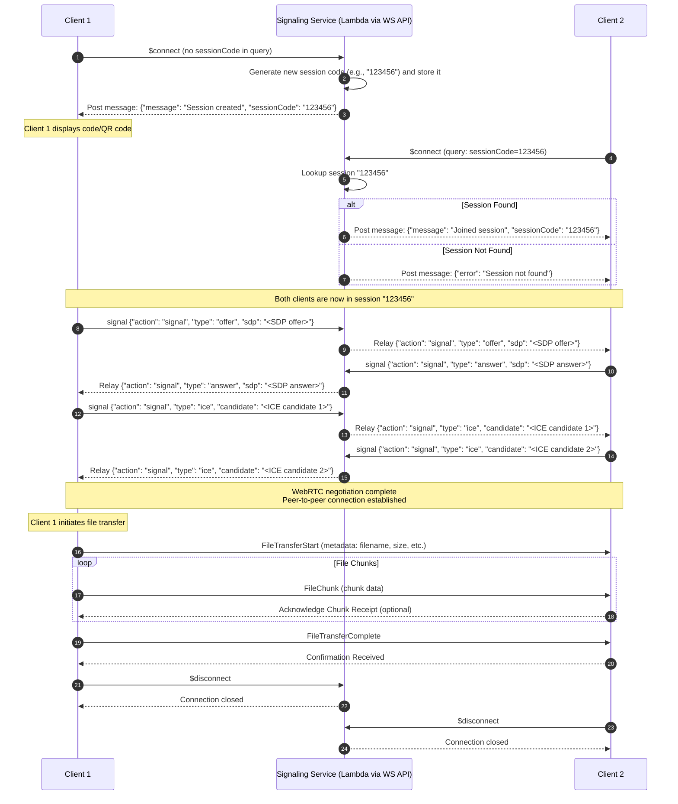

```mermaid
sequenceDiagram
    autonumber
    participant C1 as Client 1
    participant S as Signaling Service (Lambda via WS API)
    participant C2 as Client 2

    %% Connection Phase
    C1->>S: $connect (no sessionCode in query)
    S->>S: Generate new session code (e.g., "123456") and store it
    S-->>C1: Post message: {"message": "Session created", "sessionCode": "123456"}
    note over C1: Client 1 displays code/QR code

    C2->>S: $connect (query: sessionCode=123456)
    S->>S: Lookup session "123456"
    alt Session Found
        S-->>C2: Post message: {"message": "Joined session", "sessionCode": "123456"}
    else Session Not Found
        S-->>C2: Post message: {"error": "Session not found"}
    end
    note over C1,C2: Both clients are now in session "123456"

    %% WebRTC Signaling Phase
    C1->>S: signal {"action": "signal", "type": "offer", "sdp": "<SDP offer>"}
    S-->>C2: Relay {"action": "signal", "type": "offer", "sdp": "<SDP offer>"}
    C2->>S: signal {"action": "signal", "type": "answer", "sdp": "<SDP answer>"}
    S-->>C1: Relay {"action": "signal", "type": "answer", "sdp": "<SDP answer>"}
    C1->>S: signal {"action": "signal", "type": "ice", "candidate": "<ICE candidate 1>"}
    S-->>C2: Relay {"action": "signal", "type": "ice", "candidate": "<ICE candidate 1>"}
    C2->>S: signal {"action": "signal", "type": "ice", "candidate": "<ICE candidate 2>"}
    S-->>C1: Relay {"action": "signal", "type": "ice", "candidate": "<ICE candidate 2>"}
    note over C1,C2: WebRTC negotiation complete<br>Peer-to-peer connection established

    %% File Transfer Phase over WebRTC Data Channel
    note over C1: Client 1 initiates file transfer
    C1->>C2: FileTransferStart (metadata: filename, size, etc.)
    loop File Chunks
      C1->>C2: FileChunk (chunk data)
      C2-->>C1: Acknowledge Chunk Receipt (optional)
    end
    C1->>C2: FileTransferComplete
    C2-->>C1: Confirmation Received

    %% Disconnection Phase
    C1->>S: $disconnect
    S-->>C1: Connection closed
    C2->>S: $disconnect
    S-->>C2: Connection closed
```