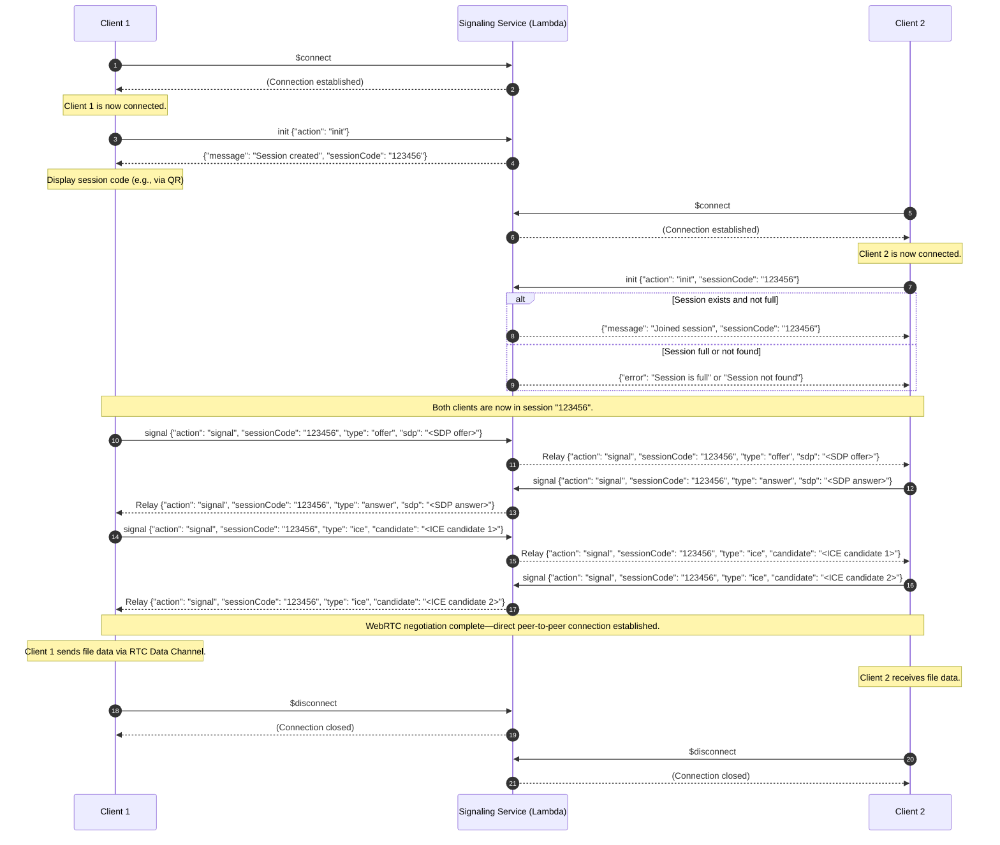

# Quick Relay WebSocket Signaling Service

This service provides a lightweight WebSocket-based signaling mechanism for establishing WebRTC peer-to-peer connections between two clients. The signaling service handles the initial connection, session pairing, and the relay of WebRTC signaling messages (such as SDP offers/answers and ICE candidates).

## How It Works

1. **Connection Establishment ($connect):**  
   When a client connects to the WebSocket endpoint, the API Gateway triggers the `$connect` route. This route is used solely to establish the connection and returns a 200 status code. No session logic is performed at this stage.

2. **Session Pairing ("init" Route):**  
   - **Session Creation:**  
     If the first client sends an `init` message without a `sessionCode`, the service creates a new session. It generates a random 6-digit session code, stores a new session record in a DynamoDB table (including the connection ID, creation time, and an expiration time via TTL), and sends the session code back to the client.
   - **Session Joining:**  
     When a second client sends an `init` message with a `sessionCode`, the service looks up the session in DynamoDB. If the session exists and has fewer than 2 connections, it adds the new connection to the session. If the session is already full (i.e., already has 2 clients) or not found, an appropriate error message is returned.

3. **Signaling ("signal" Route):**  
   Once two clients are paired in a session, they exchange WebRTC signaling messages (SDP offers/answers and ICE candidates) via the `signal` route. The service retrieves the session record, then relays the incoming signaling message to the other connection(s) in the session—excluding the sender.

4. **Disconnection ($disconnect):**  
   When a client disconnects (e.g., by closing the WebSocket connection), the `$disconnect` route is triggered. The service currently logs the disconnection. Session cleanup is handled by DynamoDB TTL, which automatically removes stale sessions.

## Mermaid Diagram

Below is the mermaid diagram that visually represents the signaling protocol:

